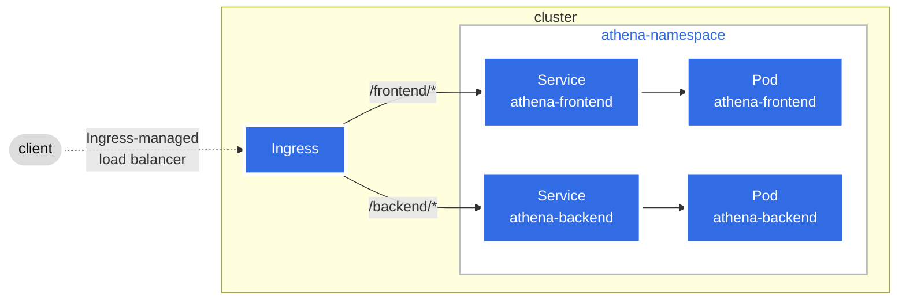

# Helm Release Manager
Sample release management using Helm (Parent & Sub Charts)

```mermaid
graph LR;
 client([client])-. Ingress-managed <br> load balancer .->ingress[Ingress];
 ingress-->|/frontend/*|service-frontend[Service<br>athena-frontend];
 ingress-->|/backend/*|service-backend[Service<br>athena-backend];

 subgraph athena-namespace
 service-frontend;
 service-backend;
 service-frontend-->pod1[Pod<br>athena-frontend];
 service-backend-->pod2[Pod<br>athena-backend];
 end

 subgraph cluster
 ingress;
 athena-namespace;
 end

 classDef plain fill:#ddd,stroke:#fff,stroke-width:4px,color:#000;
 classDef k8s fill:#326ce5,stroke:#fff,stroke-width:4px,color:#fff;
 classDef namespace fill:#fff,stroke:#bbb,stroke-width:2px,color:#326ce5;
 class ingress,service-frontend,service-backend,pod1,pod2 k8s;
 class client plain;
 class athena-namespace namespace;
```