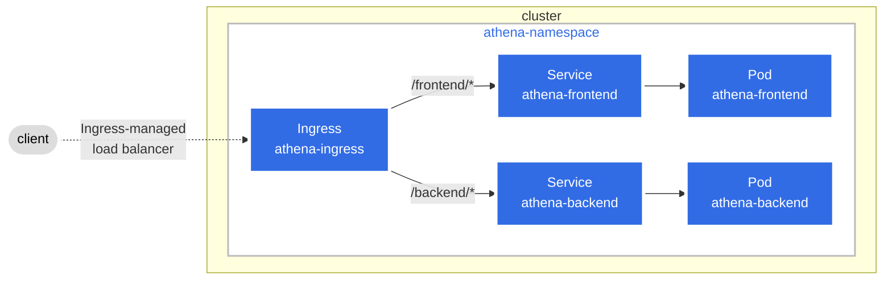

# Helm Release Manager

## Scope
In this tutorial, you will be create a namespace called `athena` and creating a `deployment` and `service` for both (frontend) and (backend) apps and exposing the services via an `ingress`



## Instructions
```
$k8s-helm-tutorial (working directory)

# Create namespace
kubectl create namespace athena

# Helm Install (creates all resources defined in parent and sub charts)
helm install athena-release .\helm-release-manager\

# Helm Upgrade (if you are updating charts / values and redeploying)
helm upgrade athena-release .\helm-release-manager\

# Expose ingress-nginx-controller
kubectl port-forward --namespace=ingress-nginx service/ingress-nginx-controller 8080:80
```

## Access the apps
```
curl http://127.0.0.1:8080/athena-frontend/headers
curl http://127.0.0.1:8080/athena-frontend/health
curl http://127.0.0.1:8080/athena-frontend/ping

curl http://127.0.0.1:8080/athena-backend/ping
curl http://127.0.0.1:8080/athena-backend/actuator/health
```
