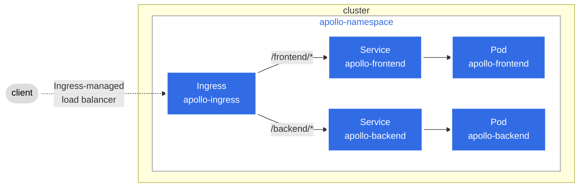

# Vanilla Kubernetes Deployments

## Scope
In this tutorial, you will be create a namespace called `apollo` and creating a `deployment` and `service` for both (frontend) and (backend) apps and exposing the services via an `ingress`



## KUBECTL - Create Deployments, Services & Ingress
```
# Create namespace
kubectl apply -f 01-namespace.yaml

# Create Frontend deployment and Service
kubectl apply -f 02-frontend-deployment-service.yaml

# Create Backend deployment and Service
kubectl apply -f 03-backend-deployment-service.yaml

# Create Ingress
kubectl apply -f 04-ingress.yaml

# Expose ingress-nginx-controller
kubectl port-forward --namespace=ingress-nginx service/ingress-nginx-controller 8080:80
```

## Access the apps
```
curl http://127.0.0.1:8080/apollo-frontend/headers
curl http://127.0.0.1:8080/apollo-frontend/health
curl http://127.0.0.1:8080/apollo-frontend/ping

curl http://127.0.0.1:8080/apollo-backend/ping
curl http://127.0.0.1:8080/apollo-backend/actuator/health
```

## KUBECTL - Delete Deployments, Services & Ingress (Backup)
```
# Delete Ingress
kubectl delete ingress apollo-ingress -n apollo

# Delete Backend Service and Deployment
kubectl delete service apollo-backend -n apollo
kubectl delete deployment apollo-backend -n apollo

# Delete Frontend Service and Deployment
kubectl delete service apollo-frontend -n apollo
kubectl delete deployment apollo-frontend -n apollo

# Delete namespace
kubectl delete namespace apollo
```

## References
### Java - Liveness and Readiness
* https://www.baeldung.com/spring-liveness-readiness-probes
* https://kubernetes.io/docs/tasks/configure-pod-container/configure-liveness-readiness-startup-probes/

### minikube addons (gotcha)
* https://robearlam.com/blog/nginx-ingress-breaking-change-ingress.class-now-required 